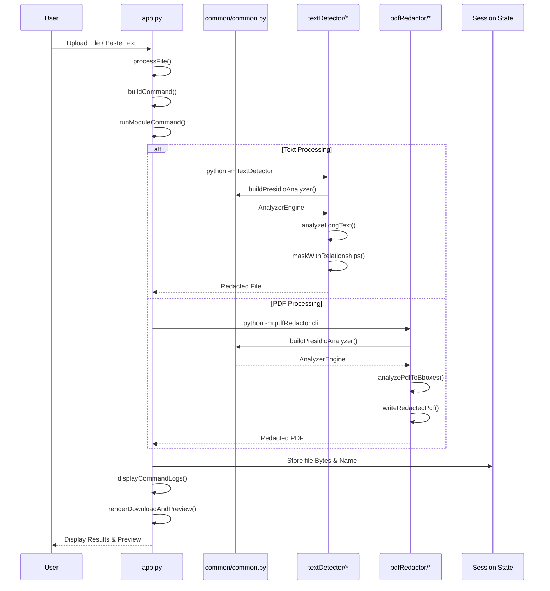
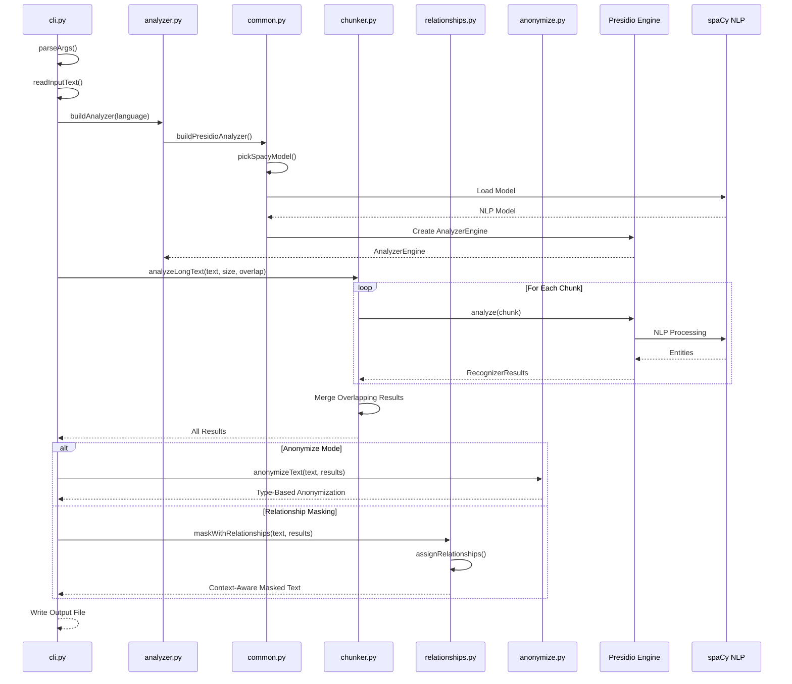
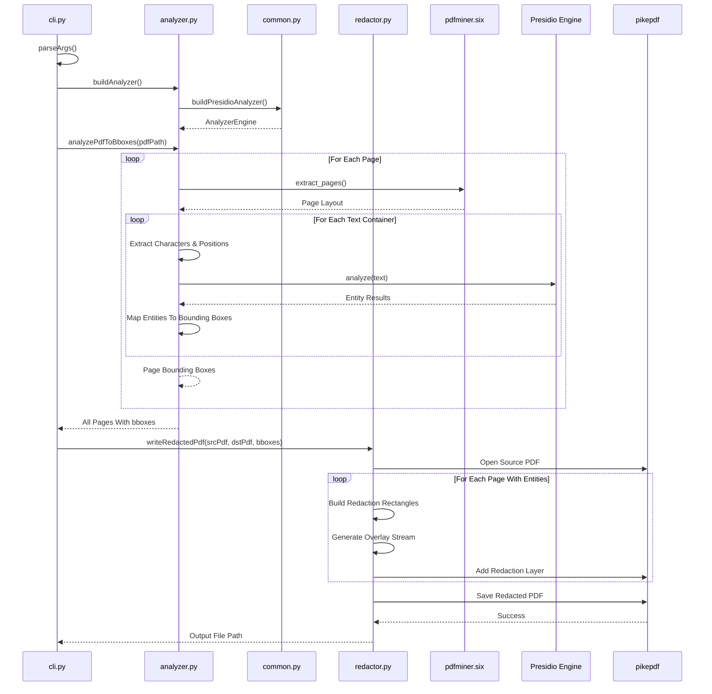
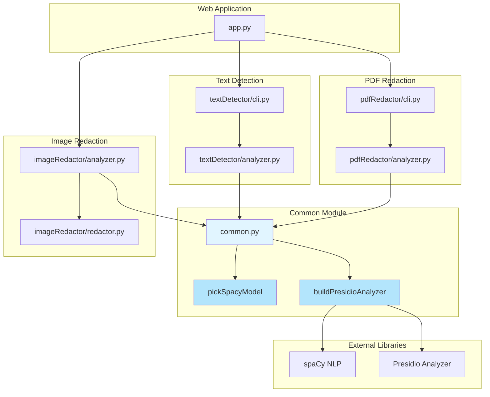

# PII & SPI: Detection + Redaction System

A comprehensive python-based solution for detecting and redacting PII and SPI from text documents, PDF's, and images.

## Project Scope

This system helps organizations protect sensitive information by automatically detecting and redacting PII/SPI such as names, email addresses, phone numbers, financial information, and more. The system designed for secure document sharing, compliance requirements, and data privacy protection.

## Features

### Multi-Format Support
- **Text Files**: process plain text documents (.txt)
- **PDF Documents**: handle both text-based and scanned PDF's using OCR
- **Images**: detect and redact PII from image files

### Dual Interface
- **Web Application**: user-friendly stream-lit interface for interactive processing
- **Command-Line Tools**: scriptable CLI for batch processing and automation

### Entity Types Detected
- Personal Names (PERSON)
- Email Addresses
- Phone Numbers
- URL's
- Credit Card Numbers
- Social Security Numbers
- Bank Account Numbers
- Australian Business Numbers (ABN)
- Custom Pattern Recognition

## Installation

### Prerequisites
- Python 3.8
- Tesseract OCR (Scanned PDF's): `brew install tesseract` on macOS

### Setup

1. **clone the repository**
```bash
git clone <repository-url>
cd pii-detection-redaction
```

2. **install dependencies**
```bash
pip install -r requirements.txt
```

3. **download spaCy language model**
```bash
python -m spacy download en_core_web_sm

# or

python -m spacy download en_core_web_lg
```

## Usage

### Web Application

```bash
streamlit run src/app.py
```

then open your browser to `http://localhost:8501`

**Features:**
- upload or paste text for analysis
- upload PDF files for redaction
- adjust detection parameters (chunk size, overlap, confidence threshold)
- preview and download redacted files
- view command execution logs

### Command-Line Interface

#### Text Detection

**basic usage:**
```bash
python -m textDetector --text "contact manan rathi at manan.rathi@example.com"
```

**from file:**
```bash
python -m textDetector --in input.txt --mask-to-file output.txt
```

**advanced options:**
```bash
python -m textDetector \
  --in input.txt \
  --size 4000 \
  --overlap 300 \
  --min-score 0.3 \
  --mask-to-file redacted.txt \
  --print-text
```

#### PDF Redaction

```bash
python -m pdfRedactor.cli --in document.pdf --out redacted.pdf
```

#### Image Redaction

```bash
python -m imageRedactor.analyzer --input image.jpg --output redacted.jpg
```

## 📁 Project Structure

```
pii-detection-redaction/
├── src/
│   ├── app.py                      # streamlit web application
│   ├── common/                     # shared utilities
│   │   ├── common.py               # presidio analyzer builders
│   │   └── __init__.py
│   ├── textDetector/               # text PII detection module
│   │   ├── analyzer.py             # analyzer engine setup
│   │   ├── chunker.py              # long text processing
│   │   ├── anonymize.py            # text anonymization
│   │   ├── formatter.py            # results formatting
│   │   ├── relationships.py        # context-aware masking
│   │   ├── cli.py                  # command-line interface
│   │   └── __main__.py
│   ├── pdfRedactor/                # PDF PII redaction module
│   │   ├── analyzer.py             # PDF text extraction & analysis
│   │   ├── redactor.py             # PDF redaction engine
│   │   ├── cli.py                  # command-line interface
│   │   └── __init__.py
│   └── imageRedactor/              # image PII redaction module
│       ├── analyzer.py             # image analysis
│       ├── redactor.py             # image redaction engine
│       ├── types.py                # data classes
│       └── __init__.py
├── styles/
│   └── theme.css                   # web app styling
├── requirements.txt                # python dependencies
└── README.md                       # this file
```

## Architecture & Flow Diagrams

### Web Application Flow



### Text Detection Module Flow



### PDF Redaction Module Flow



### Image Redaction Module Flow


### Common Module Interaction



## Configuration

### Text Detection Parameters

| Parameter | Description | Default |
|-----------|-------------|---------|
| `--size` | chunk size in characters | 5000 |
| `--overlap` | over lap between chunks | 300 |
| `--min-score` | minimum confidence threshold | 0.0 |
| `--lang` | language code | en |
| `--print-text` | echo input preview | False |
| `--anonymize` | enable anonymization mode | False |

### Detection Confidence Levels

- **1.0**: exact pattern matches (emails, URLs)
- **0.85+**: high confidence (names with context)
- **0.5-0.85**: medium confidence
- **<0.5**: low confidence (may include false positives)

## Examples

### Example 1: Basic Text Redaction

**Input:**
```
contact jane smith at jane.smith@company.com or call (555) 123-4567
```

**Output:**
```
contact <PERSON_1> at <EMAIL_ADDRESS_1> or call <PHONE_NUMBER_1>
```

### Example 2: Relationship-Aware Masking

**Input:**
```
john's email is john@example.com
sarah's phone is 555-1234
```

**Output:**
```
john's email is <John's EMAIL_ADDRESS>
sarah's phone is <Sarah's PHONE_NUMBER>
```

### Example 3: PDF with Multiple Pages

```bash
python -m pdfRedactor.cli --in contract.pdf --out contract_redacted.pdf
```

creates a new PDF with all detected PII regions permanently redacted with black boxes.

## Technology Stack

- **Microsoft Presidio**: PII detection and anonymization framework
- **spaCy**: advanced NLP and named entity recognition
- **Stream Lit**: modern web application framework
- **pdfminer.six**: PDF text extraction
- **pikepdf**: PDF manipulation and editing
- **pytesseract**: OCR for scanned documents
- **Pillow**: image processing

## Requirements

see [requirements.txt](requirements.txt) for complete list:

```txt
streamlit>=1.20.0
streamlit-pdf-viewer>=0.0.15
presidio-analyzer>=2.2.0
presidio-anonymizer>=2.2.0
presidio-image-redactor>=0.0.50
spacy>=3.5.0
pdfminer.six>=20221105
pikepdf>=8.0.0
Pillow>=10.0.0
pytesseract>=0.3.10
```

## Privacy & Security

- all processing happens locally: no data is sent to external servers
- redacted files are generated with permanent removal (not just visual masking)
- original files remain unchanged
- temporary files are automatically cleaned up

## Limitations

- spaCy model accuracy varies by entity type and context
- scanned PDF processing requires Tesseract OCR installation
- very large files may require increased memory
- some context-dependent PII may be missed (requires human review)

**Note**: this tool aids in PII detection but should not be solely relied upon for compliance. always review redacted documents manually for sensitive use cases.
