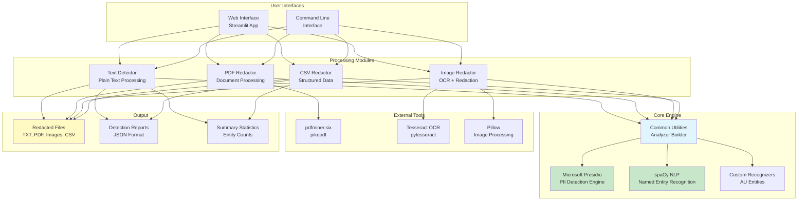
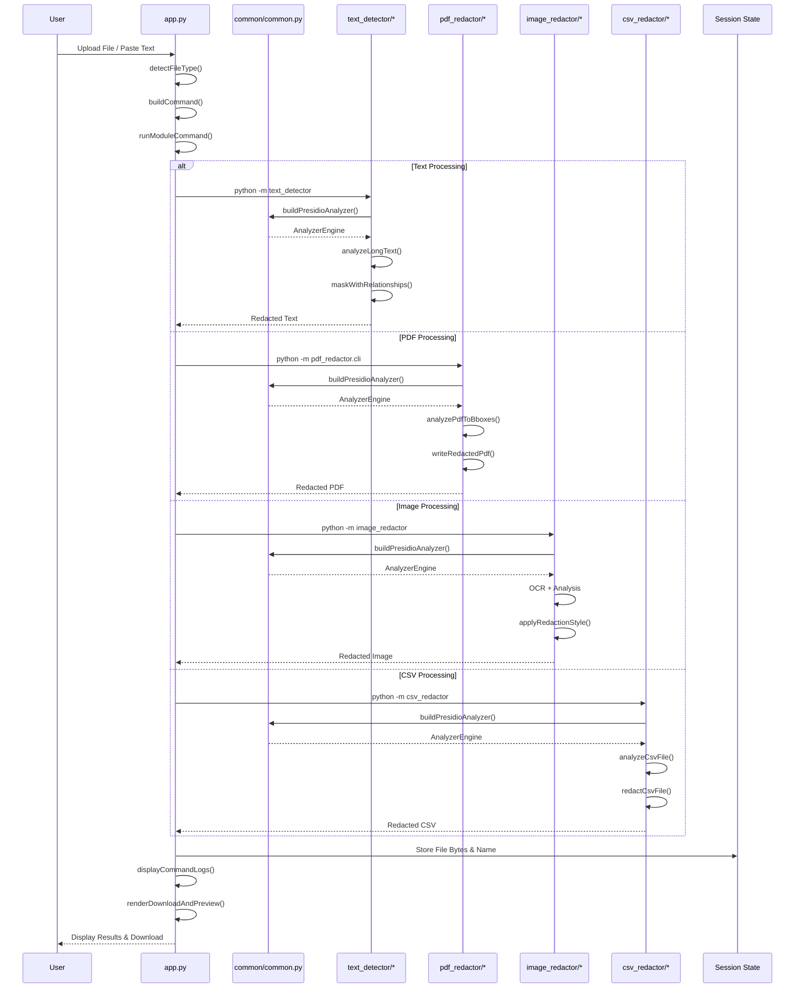
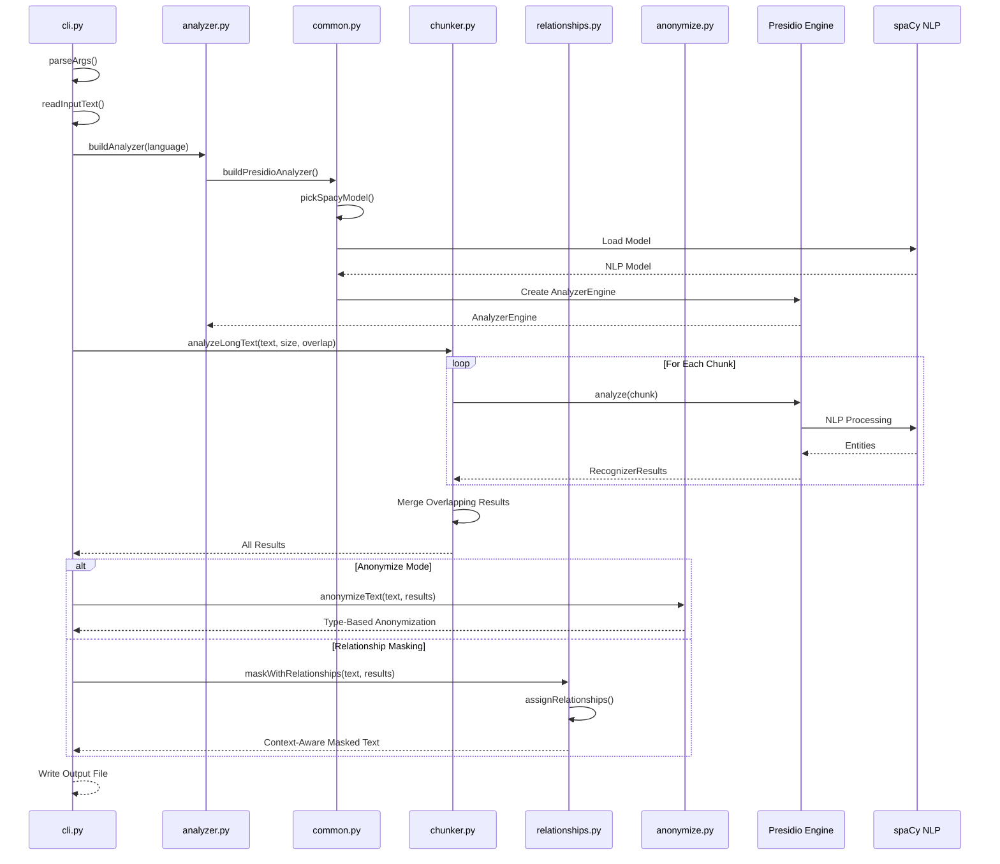
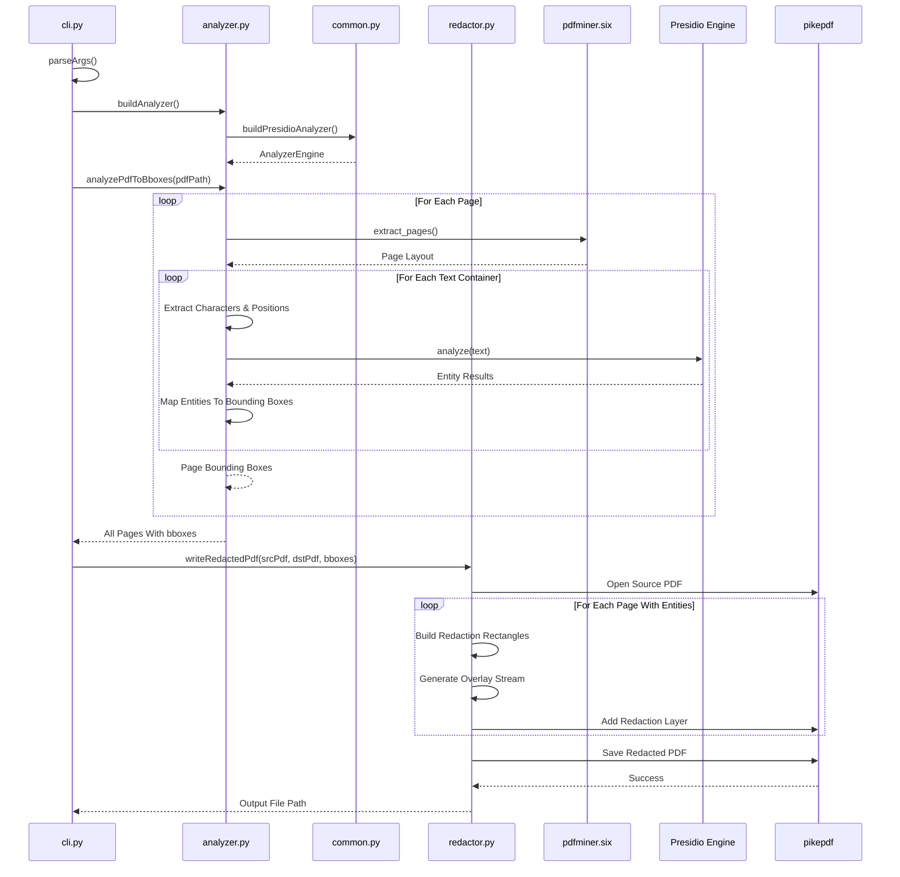
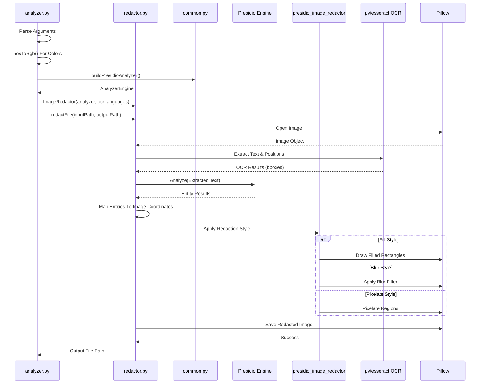
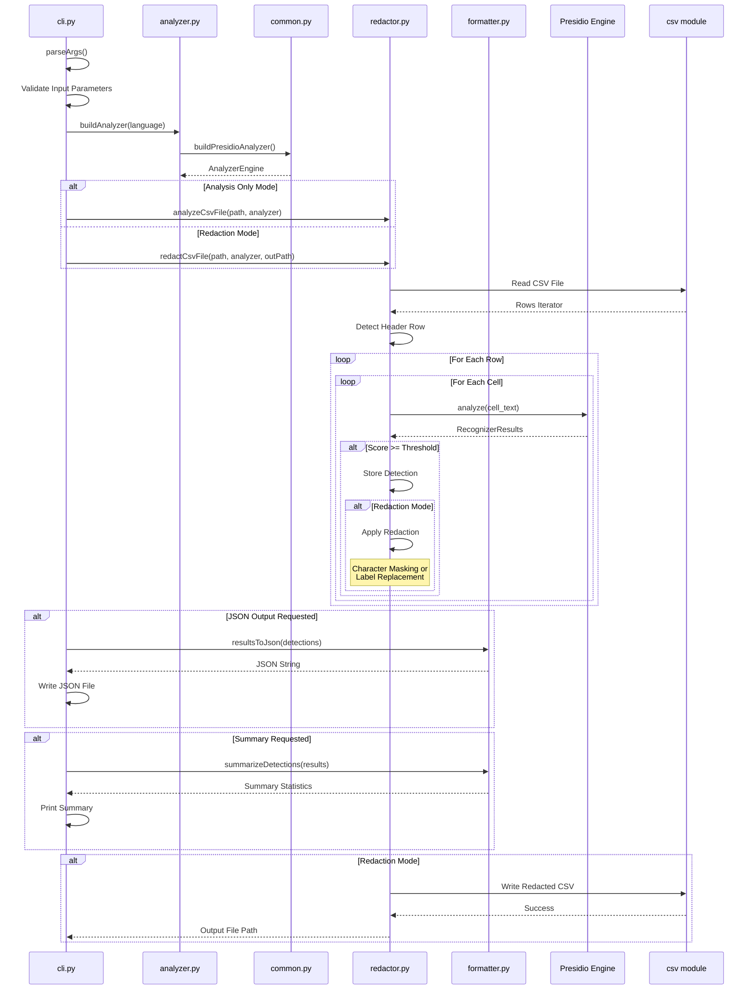
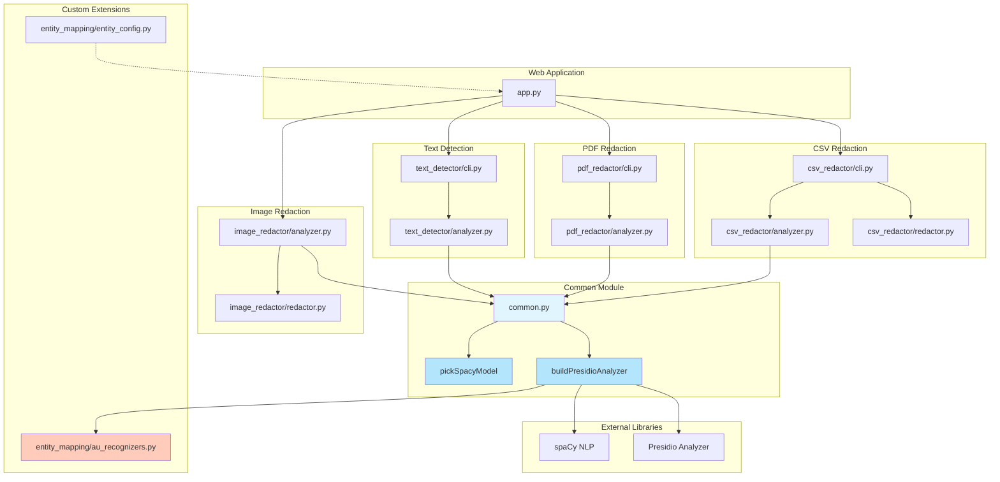
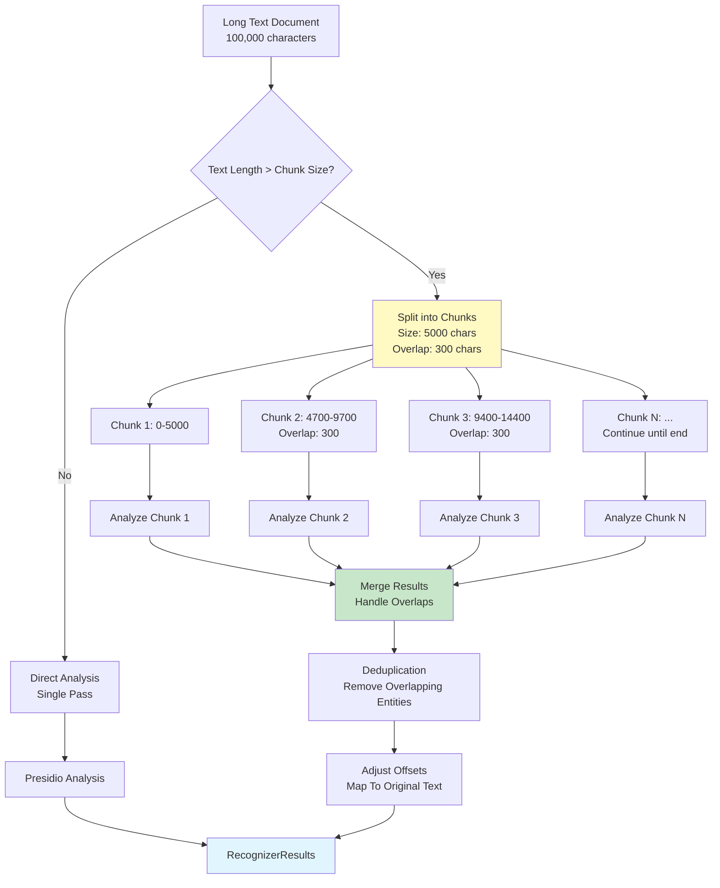
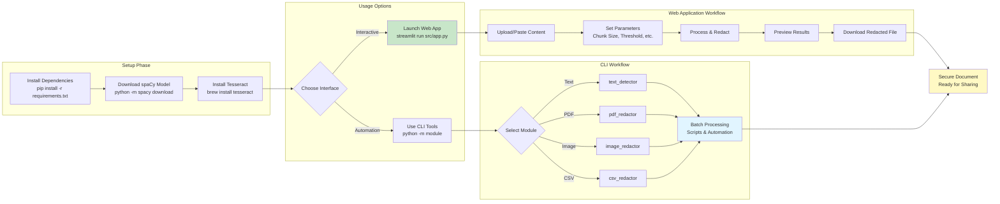
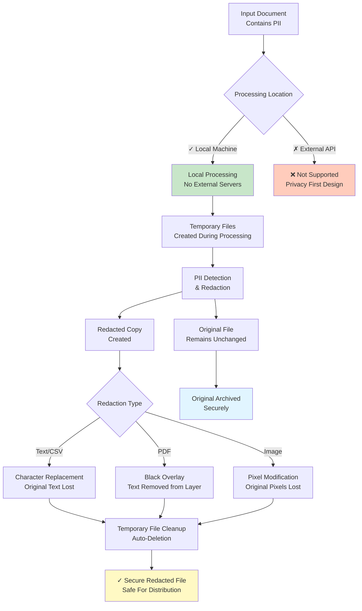

# PII & SPI: Detection + Redaction System

A comprehensive python-based solution for detecting and redacting personally identifiable information and sensitive personal information from text documents, PDF's, and images using natural language processing and optical character recognition.

## Features

### Core Capabilities
- **Multi-Format Support**: process text files, PDFs (text-based and scanned), images, and CSV spreadsheets
- **Dual Interface**: user-friendly web application + scriptable command-line tools
- **Local Processing**: all operations run locally - no data sent to external servers
- **Privacy-First**: permanent redaction with automatic cleanup of temporary files

### Detection & Analysis
- **Named Entity Recognition (NER)**: advanced NLP using spaCy models for context-aware detection
- **Pattern Matching**: regex-based detection for structured data (emails, phone numbers, credit cards)
- **Custom Recognizers**: australian-specific entities (ABN, TFN, Medicare numbers)
- **Configurable Thresholds**: adjustable confidence scores to balance precision and recall
- **Multi-Language Support**: extensible language support via spaCy models
- **Long Text Processing**: intelligent chunking with overlap for documents of any size
- **OCR Integration**: tesseract OCR for scanned PDFs and images

### Redaction Options
- **Multiple Redaction Styles**:
  - **Fill**: solid color rectangles (black, custom colors)
  - **Blur**: gaussian blur effect for images
  - **Pixelate**: pixelation effect for images
- **Label-Based Replacement**:replace PII with entity type labels (e.g., `<PERSON>`, `<EMAIL>`)
- **Relationship-Aware Masking**: context-based labels (e.g., "John's email" → `<John's EMAIL_ADDRESS>`)
- **Anonymization Mode**: type-based anonymization with customizable operators
- **Character Customization**: configurable redaction characters (default: `*`)
- **Permanent Removal**: true redaction, not just visual masking

### Output & Reporting
- **Redacted Files**: generate clean, redacted versions of all file types
- **JSON Export**: structured detection results with entity types, positions, and confidence scores
- **Summary Reports**: statistical overview of detections by entity type
- **Command Logs**: detailed execution logs in web interface
- **Preview Capability**: in-app preview of redacted content before download
- **CSV Structure Preservation**: maintain headers, delimiters, and formatting

### Advanced Features
- **Batch Processing**: CLI tools for automated, large-scale operations
- **Header Row Handling**: smart CSV processing with optional header preservation
- **Custom Delimiters**: support for various CSV formats (comma, tab, semicolon, etc.)
- **Confidence Filtering**: minimum score thresholds to reduce false positives
- **Adjustable Parameters**: chunk size, overlap, language, and more
- **Error Handling**: robust exception handling with informative error messages

## Project Structure

```
pii-detection-redaction/
├── src/
│   ├── app.py                      # streamlit web application
│   ├── common/                     # shared utilities
│   │   ├── common.py               # presidio analyzer builders
│   │   └── __init__.py
│   ├── text_detector/              # text PII detection module
│   │   ├── analyzer.py             # analyzer engine setup
│   │   ├── chunker.py              # long text processing
│   │   ├── anonymize.py            # text anonymization
│   │   ├── formatter.py            # results formatting
│   │   ├── relationships.py        # context-aware masking
│   │   ├── cli.py                  # command-line interface
│   │   └── __main__.py
│   ├── pdf_redactor/               # PDF PII redaction module
│   │   ├── analyzer.py             # PDF text extraction & analysis
│   │   ├── redactor.py             # PDF redaction engine
│   │   ├── cli.py                  # command-line interface
│   │   └── __init__.py
│   ├── image_redactor/             # image PII redaction module
│   │   ├── analyzer.py             # image analysis
│   │   ├── redactor.py             # image redaction engine
│   │   ├── types.py                # data classes
│   │   └── __init__.py
│   ├── csv_redactor/               # CSV PII redaction module
│   │   ├── analyzer.py             # analyzer engine setup
│   │   ├── redactor.py             # CSV redaction engine
│   │   ├── formatter.py            # results formatting
│   │   ├── cli.py                  # command-line interface
│   │   └── __main__.py
│   └── entity_mapping/             # australia-specific entities
│       ├── au_recognizers.py       # custom recognizers
│       ├── entity_config.py        # severity & color mappings
│       └── __init__.py
├── styles/
│   └── theme.css                   # web app styling
├── requirements.txt                # python dependencies
└── README.md                       # this file
```

## Architecture & Flow Diagrams

### System Architecture Overview



### Web Application Flow



### Text Detection Module Flow



### PDF Redaction Module Flow



### Image Redaction Module Flow



### CSV Redaction Module Flow



### Common Module Interaction



### Text Chunking Strategy



### Deployment & Usage Workflow



### Data Privacy & Security Flow



## Technology Stack

- **Microsoft Presidio**: PII detection and anonymization framework
- **spaCy**: advanced NLP and named entity recognition
- **Stream-Lit**: modern web application framework
- **pdfminer.six**: PDF text extraction
- **pikepdf**: PDF manipulation and editing
- **pytesseract**: OCR for scanned documents
- **pillow**: image processing

## Requirements

see [requirements.txt](requirements.txt) for complete list.